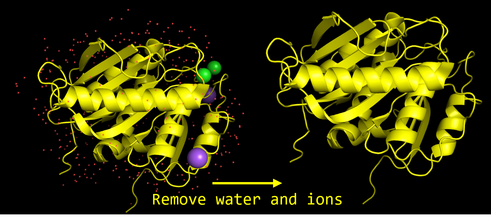
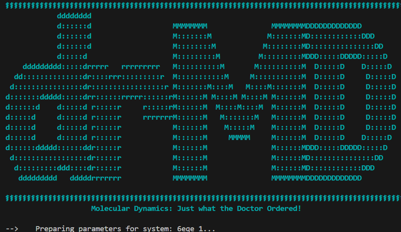
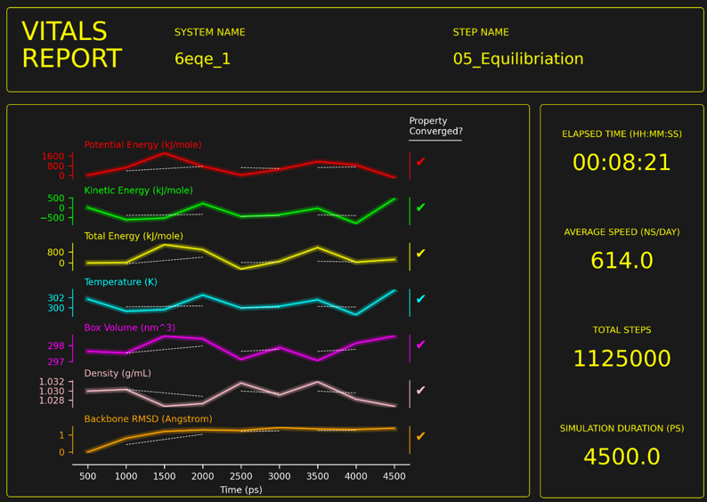
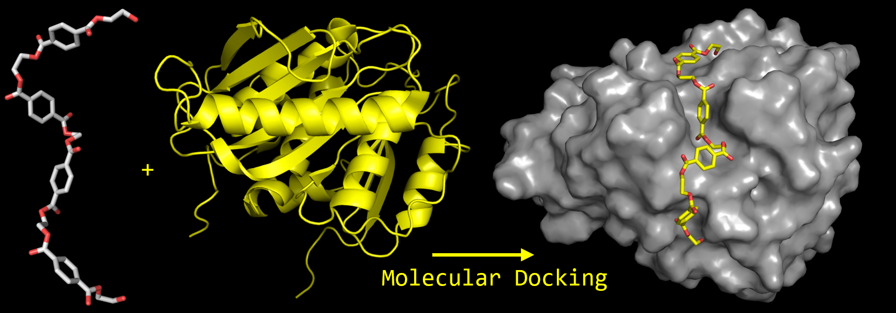
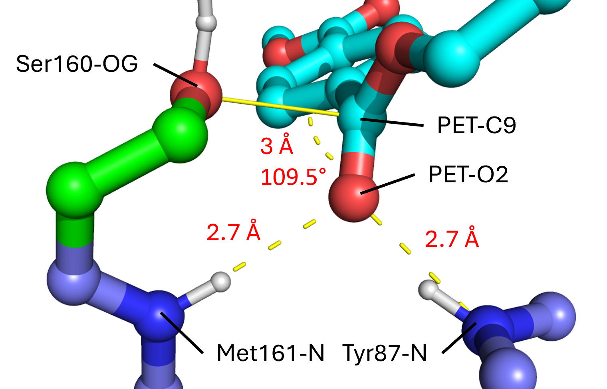
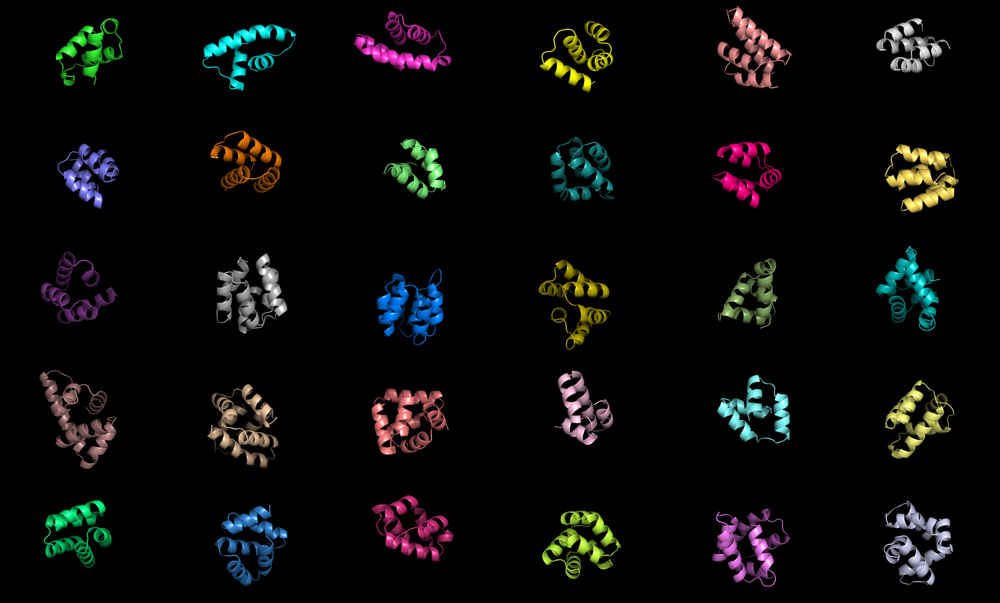
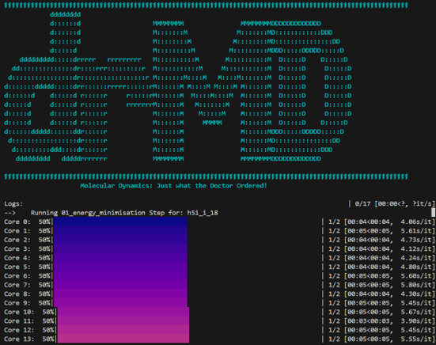
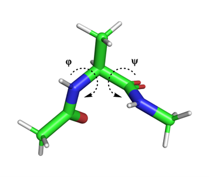
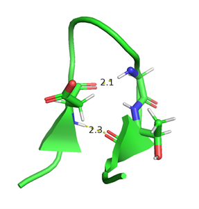

# :medical_symbol: **drMD**: Molecular Dynamics for Experimentalists :medical_symbol:
Automated workflow for running molecular dynamics simulations with Amber and Openmm
# :medical_symbol: README Contents :medical_symbol:

1. **Installation**
   - [GitHub Installation](#github-installation)
   - [Pip Installation](#pip-installation)
2. **Running drMD**: [Running **drMD** from the command line](#run-from-cmd-line) | [Running **drMD** as a Python Module](#run-from-python)
3. **Config Syntax**
   - **Path Info**: [inputDir](#inputdir) | [outputDir](#outputdir)
   - **Hardware Info**: [platform](#platform) |[parallelCPU](#parallelcpu) | [subprocessCpus](#subprocesscpus)
   - **Misc Info**: [pH](#pH) | [firstAidMaxRetries](#firstaidmaxretries) | [boxGeometry](#boxgeometry) | [boxSize](#boxsize) | [writeMyMethodsSection](#writemymethodssection) | [skipPdbTriage](#skippdbtriage) | [trajectorySelections](#trajectoryselections)
   - **Ligand Info**: [ligandName](#ligandname) | [protons](#protons) | [charge](#charge) | [frcmod](#frcmod) | [mol2](#mol2)
   - **Simulation Info**: [stepName](#stepname) | [simulationType](#simulationtype) | [temperature](#temperature) | [temperatureRange](#temperaturerange) | [maxIterations](#maxiterations) | [duration](#duration) | [timestep](#timestep) | [logInterval](#loginterval)
   - **Aftercare Info**: 
     - **End Point Info**: [stepNames](#stepnamesendpoint) | [removeAtoms](#removeatomsendpoint)
     - **Cluster Info**: [stepNames](#stepnamescluster) | [removeAtoms](#removeatomscluster) | [nClusters](#nclusters) | [clusterBy](#clusterby)
4. **drMD Selection Syntax**: [keyword](#keyword) | [customSelection](#customselection)
5. **Adding Restraints in drMD**: [restraintInfo](#restraintinfo) | [restraintType](#restrainttype) | [parameters](#parameters)
6. **Running Metadynamics with drMD**: [metaDynamicsInfo](#metadynamicsinfo) | [height](#height) | [biasFactor](#biasfactor) | [frequency](#frequency) | [biases](#biases)
7. **Worked Examples**
    - [Example 1: MD Simulation of a Protein](#worked-example-1)
    - [Example 2: Restrained MD of Protein-Ligand Complex](#worked-example-2)
    - [Example 3: Energy Minimisation of Structures](#worked-example-3)
    - [Example 4: Using drMD default settings](#worked-example-4)
    - [Example 5: Metadynamics Simulation of Alanine Dipeptide](#worked-example-5)
    - [Example 6: Metadynamics Simulation of Chignolin Peptide](#worked-example-6)

# :medical_symbol: GitHub Installation :medical_symbol:
We recommend that you use the following steps to install **drMD**:
1. Clone this repository
```bash
git clone https://github.com/wells-wood-research/drMD
```

2. Create conda environment using the environment.yaml file
```bash
conda env create -f environment.yaml
```

3. Activate conda environment
```bash
conda activate drMD
```

## :medical_symbol: Step-by-step installation :medical_symbol:
You may instead wish to install the dependencies in a stepwise manner:
1. Clone this repository
```bash
git clone https://github.com/wells-wood-research/drMD
```

2. Create and activate conda environment
```bash
conda create -n drMD python=3.10
```
```bash
conda activate drMD
```
3. Install AmberTools (needs to be before OpenMM) with conda
```bash
conda install -c conda-forge ambertools=23
``` 
4. Install OpenMM with conda
```bash
conda install -c conda-forge openmm
``` 
5. Install OpenBabel with conda
```bash
conda install -c conda-forge openbabel
```
6. Install Pango with conda (optional, but can solve compatibility issues associated with *weasyprint*)
```bash
conda install -c conda-forge pango
```

7. Install other python libraries with pip
```bash
pip install -r requirements.txt
```

# :medical_symbol: Pip Installation :medical_symbol:
If you want to integrate **drMD** into a python-based pipeline, you can install **drMD** with pip and use it as a python module:

1. Create and activate conda environment
```bash
conda create -n drMD python=3.10
```
```bash
conda activate drMD
```
2. Install **drMD** with pip
```bash
pip install drMD
```
3. Install AmberTools (needs to be before OpenMM) with conda
```bash
conda install -c conda-forge ambertools=23
``` 
4. Install OpenMM with conda
```bash
conda install -c conda-forge openmm
``` 
5. Install OpenBabel with conda
```bash
conda install -c conda-forge openbabel
```

<a id="running-drmd"></a>
# :medical_symbol: Running **drMD** :medical_symbol:

Now that you have successfully set up the dependencies for **drMD**, you are nearly ready to run some bimolecular simulations!

<a id="run-from-cmd-line"></a>
## :brain: Running **drMD** from the command line

If you have used the GitHub installation method, you can run **drMD** using the following command:

```bash
python /path/to/drMD.py --config config.yaml
```
<a id="run-as-python-module"></a>
## :brain: Running **drMD** as a python module
If you have used the Pip installation method, you can import **drMD** as a python module, and as following:

```python
import drMD

myBatchConfig = "/path/to/config.yaml"

drMD.main(myBatchConfig)
```

This config file contains all of the user inputs **drMD** needs to run a series of bimolecular simulations.
The following section will detail the correct formatting of this config.yaml file

<a id="configSyntax"></a>
# :medical_symbol: Config syntax :medical_symbol:
The config.yaml file is in the [YAML format](https://yaml.org/spec/1.2.2/)
Inputs are grouped by theme and are stored as nested dictionaries and lists.
The next few sections will detail the correct formatting of the config.yaml file

For most entries in the config file, the default value will be used unless otherwise specified.
If your config file is improperly formatted, or contains a parameter that is not supported, **drMD** provide useful guidance to help you fix this issue.

<a id="pathinfo"></a>
## :brain: pathInfo
The **pathInfo** entry in the config file is a dictionary containing two parameters:
<a id="inputdir"></a>
### :anatomical_heart: inputDir
*(DirectoryPath)* This is the absolute path towards a directory containing PDB files that will be used as starting points for your simulations.

**Default Value**: `Current working directory`
            
  > :medical_symbol:
  > **To Perform Replicate** simulations, simply create copies of your starting PDB files in the inputDir, with each copy
  > named with a unique number. For example, your inputDir could contain my_protein_1.pdb, my_protein_2.pdb, etc.

<a id="outputdir"></a>
### :anatomical_heart:  outputDir  
*(DirectoryPath)*  This is the absolute path towards a directory that you want your **drMD** outputs to be written to.

**Default Value**: `/inputDir/outputs` 

  > :medical_symbol:
  > The outputDir will be created if it does not already exist at the point of running **drMD**

  > :medical_symbol:
  > Within outputDir, a directory will be created for each PDB file contained in inputDir, in this document, these subdirectories will be referred to
  > as **runDirs**

Example pathInfo:
```yaml
pathInfo:
  inputDir: "/home/esp/scriptDevelopment/drMD/01_inputs"
  outputDir: "/home/esp/scriptDevelopment/drMD/02_outputs"
```
<a id="hardwareinfo"></a>
## :brain: hardwareInfo
This config entry tells **drMD** about your computer hardware and how you want to use it to run your simulations
The **hardwareInfo** entry in the config file is a dictionary containing three parameters:

<a id="platform"></a>
### :anatomical_heart:  platform
*(str)* This is the platform that will be used to run simulations in OpenMM. Accepted arguments for **platform** are *"CUDA"*, *"OpenCL"*, and *"CPU"*

**Default Value**: `CPU`

  > :medical_symbol:
  > If you have access to GPU acceleration using CUDA, we recommend this option. If you cant use CUDA but have access to OpenCL, this is a close second.
  > If you don't have a GPU you can use the CPU option, this will be a lot slower.
  > Energy minimisation calculations do not benefit from GPU acceleration, so you should use the CPU option for these

<a id="parallelCPU"></a>
### :anatomical_heart:  parallelCPU
*(int)* This is the number  of simulations that will be run in parallel

**Default Value**: `1`

<a id="subprocesscpus"></a>
### :anatomical_heart:  subprocessCpus
 *(int)* This is the number of cpu cores that will be allocated to each simulation.  

**Default Value**: `1`

  > :medical_symbol:
  > The total CPU usage will be parallelCPU * subprocessCpus, so make sure you have enough CPUs when you set these parameters

Example hardwareInfo:
```yaml
hardwareInfo:
  parallelCPU: 16
  platform: "CUDA"
  subprocessCpus: 2
```
This will use CUDA to achieve GPU acceleration and run 16 simulations in parallel using 2 cores each for a total usage of 32 cores.

---

<a id="miscinfo"></a>
## :brain: miscInfo
This section allows you to set some general options for your simulations:

<a id="ph"></a>
### :anatomical_heart:  pH
 *(int or float)* This is the pH of your simulation, this will affect the protonation states of your protein and any ligands present in your simulation

**Default Value**: `7`

<a id="firstaidmaxretries"></a>
### :anatomical_heart:  firstAidMaxRetries
*(int)* This is the maximum number of times that **drMD** will attempt to recover from an error in a simulation

**Default Value**: `10`

> :medical_symbol: This option can be very helpful for rescuing crashed simulations. However 
> don't rely on it too much. If your simulation keeps crashing you may want to reduce the 
> temperature or timestep parameters instead to make it more stable

<a id="boxgeometry"></a>
### :anatomical_heart:  boxGeometry 
*(str)*  This is the shape of the solvation box that will be used in your simulations. Accepted arguments for **boxGeometry** are *"cubic" or "octahedral"

**Default Value**: `cubic`

<a id="boxsize"></a>
### :anatomical_heart:  boxSize
*(int)* This determines the size of the solvation box that will be used in your simulations. A water box around your protein will be created such that the box is at least `boxSize` angstroms from your protein.

**Default Value**: 10

<a id="writemymethodsection"></a>
### :anatomical_heart:  writeMyMethodsSection
*(bool)* If set to TRUE, **drMD** will automatically write a methods section for you to use in your publications or thesis

**Default Value**: `True`

> :medical_symbol: **drMD** methods sections contain all of the information one might need to replicate your simulations.
> The formatting of these methods section may be too robotic and repetitive for you, feel free to reformat them as you see fit. 

<a id="skippdbtriage"></a>
### :anatomical_heart:  skipPdbTriage
*(bool)* **drMD** runs a pdbTriage protocol to check the validity of your PDB files before running your simulations. To disable this step, set this parameter to `True`

**Default Value**: `False`

<a id="trajectoryselections"></a>
### :anatomical_heart:  trajectorySelections

*(list of dicts)* This entry controls the atoms that are written to your MD trajectories. You can specify any selection of atoms that you whish to write to your trajectories. For a full description of how to do this, see [**drMD** Selection syntax](#drmd-selection-syntax)

**Default Value**: `[{"selection": {"keyword": 'all'}}]}` (this will write all atoms to your trajectory files)

Example miscInfo:
```yaml
miscInfo:
  pH: 7.4
  firstAidMaxRetries: 10
  boxGeometry: cubic
  boxSize: 10
  writeMyMethodsSection: True
  skipPdbTriage: False
  trajectorySelections:
  - selection:
      keyword: protein
  - selection:
      keyword: ligand
```
Simulations will be run with a pH of 7.4 in a cubic solvation box with a padding of 10 Angstroms. The maximum number of first-aid retries will be 10. A methods section will automatically be generated. The pdbTriage protocol will not be skipped. Only the protein and ligand will be written to your trajectory files (this will save a lot of disk space by excluding water and ions)

<a id="ligandinfo"></a>
## :brain: ligandInfo
The `ligandInfo` entry in the config file is optional and may be used if your PDB files have organic ligand or cofactors.
These small molecules will not have parameters in the AMBER forcefield, **drMD** will run an automated protocol to generate these parameters for you.
To do this, you will need to tell **drMD** some things about each ligand you whish tp simulate.

> :medical_symbol:
The `ligandInfo` entry is *optional*. **drMD** will automatically detect ligand in your PDB files. It will also detect
parameter files in your input directory. If you have frcmod and mol2 files for your ligand already made, they must be located in your `inputDir`

**ligandInfo** is a list of dictionaries that contain the following parameters:

<a id="ligandname"></a>
### :anatomical_heart:  ligandName
*(str)*  This is the three letter name of the ligand, this will be used to match the residue names in your PDB files

<a id="protons"></a>
### :anatomical_heart:  protons
  *(bool)*  This is a to tell **drMD** whether you have protons on your ligand. 
              If set to FALSE, **drMD** will run an automated protonation protocol to add protons to your ligand

  > :medical_symbol:
  > The automatic protonation protocol only works reliably for simple organic ligands.

  > :medical_symbol:
  > For more complex ligand, we recommended that you manually add protons in your input PDB file prior to running **drMD**

<a id="charge"></a>
### :anatomical_heart: charge
*(int)*  This is the formal charge of the ligand 

<a id="frcmod"></a>
### :anatomical_heart: frcmod
*(bool)*  This is to tell **drMD** whether you have an frcmod file for your ligand already made.
                If you already have one, it must be located in the `01_ligand_parameters` directory within your outputDir

<a id="mol2"></a>
### :anatomical_heart:  mol2
*(bool)*   This is to tell **drMD** whether you have a mol2 file for your ligand already made.
                If you already have one, it must be located in the `01_ligand_parameters` directory within your outputDir

Example ligandInfo:
```yaml
ligandInfo:
  - ligandName: "FMN"
    protons: True
    charge: -1
    frcmod: False
    mol2: False
  - ligandName: "TPA"
    protons: True
    charge: -2
    frcmod: False
    mol2: False
```
This `ligandInfo` tells **drMD** to expect two ligands: FMN and TPA. FMN has a formal charge of -1 and TPA has a formal charge of -2. Both ligands already have protons, so **drMD** will not add any. For both ligands the frcmod and mol2 parameters are set to False, **drMD** will automatically generate these files for you

---

<a id="simulationinfo"></a>
## :brain: simulationInfo
This is the real meat and potatoes of the **drMD** config file. 

The `simulationInfo` entry in the config file is a list of dictionaries containing information about each simulation.

Each simulation detailed in `simulationInfo` will be run in sequence, with the output of the previous simulation being the starting point for the next simulation.
Each simulation dictionary contains the following parameters:

<a id="stepnamesiminfo"></a>
### :anatomical_heart:  stepName
*(str)* This is the name of the step that will be used to create a subdirectory in the runDir, we recommend prefixing these names with numbers to make them order nicely

<a id="simulationtype"></a>
### :anatomical_heart: simulationType
*(str)* This is the type of simulation that will be run. Accepted arguments are:

  - `EM`         This will run a steepest-decent Energy Minimisation step. 
  > :medical_symbol:
  > We recommend that you run one of these steps before any other simulation steps
  - `NVT`:        This will run an NVT (constant volume) molecular dynamics simulation
  - `NPT`:        This will run an NPT (constant pressure) molecular dynamics simulation
  > :medical_symbol:
  > For the majority of protein simulations, the NPT ensemble is used for production MD simulations, while the NVT ensemble is only used in equilibration steps
  - `META`:       This will run a Metadynamics simulation 

### Selecting simulation temperature 
For most simulations, a constant temperature is used. In this case the following parameter is required:

<a id="temperature"></a>
#### :anatomical_heart: temperature
*(int)* This is the temperature of the simulation in Kelvin 

If you wish to change the temperature throughout the simulation, the following parameter is required:


<a id="temperaturerange"></a>
#### :anatomical_heart: temperatureRange
*(list of int)* This is a list of integers (again, in Kelvin) that will be used to change the temperature throughout the simulation. 

### Energy Minimisation Parameters
For Energy Minimisation steps, the following additional parameters are required:

<a id="maxiterations"></a>
#### :anatomical_heart: maxIterations
*(int)* This is the maximum number of iterations that will be run in the Energy Minimisation step.
If this parameter is set to -1, the step will run until the energy converges.

Example Energy Minimisation syntax:
```yaml
simulationInfo:
  - stepName: "01_energy_minimisation"
    type: "EM"
    temp: 300
    maxIterations: -1
```
This will run a energy minimisation until the energy converges

### Generic Simulation Parameters
For "normal" MD simulations using NVT or NpT ensembles, as well as for Metadynamics simulations, the following additional parameters are required:

<a id="duration"></a>
#### :anatomical_heart: duration
*(str)* This is the duration of the simulation step, as a string "int unit" eg. "1000 ps"

<a id="timestep"></a>
#### :anatomical_heart: timestep
 *(str)* This is the timestep of the simulation, as a string "int unit" eg. "2 fs"

<a id="heavyProtons"></a>
#### :anatomical_heart: heavyAtoms
*(bool)*  If set to True, the mass of each proton will be set to 4 amu instead of 1 amu in this simulation step (this increase in mass is compensated by reducing the mass of nearby heavy atoms). On its own, this setting does nothing. It does however allow you to perform you simulation step with a longer [timestep](#timestep) (we recommend 4 fs). Simulations run with longer timesteps will be faster, but can be prone to instability. 

<a id="loginterval"></a>
#### :anatomical_heart: logInterval
*(str)* This is the frequency that the simulation will write to file using built-in OpemMM reporters. As a string "int unit" eg. "100 ps"

Example NVT simulation syntax:
```yaml
simulationInfo:
  - stepName: "02_NVT_pre-equilibration"
    type: "NVT"
    duration: "100 ps"
    timestep: "2 fs"
    temp: 300
    logInterval: "10 ps"
```
This will run a 100 ps NVT molecular dynamics simulation with a timestep of 2 fs, a temp of 300 and a logInterval of 10 ps

---

### :medical_symbol: Simulation Aftercare :medical_symbol:
After all of your simulations have been run, **drMD** contains some simple utilities for organising your output files and deleting any unwanted files.

If you want to do any post-processing, you will need to provide the following parameter in your config file:

<a id="aftercareinfo"></a>
### :brain: aftercareInfo
 *(dict)* This is a dictionary containing the parameters for the post-simulation processing

If you wish to collect PDB files that represent the last frame of each simulation, you may include the following parameter in **aftercareInfo**:

<a id="endpointinfo"></a>
### :brain: endpointInfo
*(dict)* This is a dictionary containing the parameters the following parameters:

<a id="stepnamesendpoint"></a>
#### :anatomical_heart: stepNames
*(list)* This is a list of strings containing the names of the steps in the simulation, these should match the stepNames that you have used in your simulationInfo dictionary (described above). Endpoint PDB files will be gathered for these steps

<a id="removeatomsendpoint"></a>
#### :anatomical_heart: removeAtoms
*(list)* This is a list of dictionaries containing the selections of atoms to be removed from the PDB files. For a full description of how to do this, see [**drMD** Selection syntax](#drmd-selection-syntax)

Molecular Dynamics simulations can generate very large output files that can become rather unwieldy and difficult to analyse. One way to quickly see the most important parts of your simulation is to perform clustering on your simulation trajectories. To do this with **drMD**, include the following parameter in your config file:

<a id="clusterinfo"></a>
### :brain: clusterInfo
*(dict)* This is a dictionary containing the parameters following parameters:

<a id="stepnamescluster"></a>
#### :anatomical_heart: stepNames
*(list)* This is a list of strings containing the names of the steps in the simulation, these should match the stepNames that you have used in your simulationInfo dictionary (described above). Clustering will be performed on trajectories of these steps

<a id="nclusters"></a>
#### :anatomical_heart: nClusters
*(int)* This is the number of clusters PDB files that will be generated

<a id="clusterby"></a>
#### :anatomical_heart: clusterBy
*(list)* This is a list of selections of atoms to cluster on. If you want to explore the motions of one particular group of atoms in your system (e.g. the backbone of a protein), you can include a selection of these atoms in this parameter. For a full description of how to do this, see [**drMD** Selection syntax](#drmd-selection-syntax)

<a id="removeatomscluster"></a>
#### :anatomical_heart: removeAtoms
*(list)* This is a list of dictionaries containing the selections of atoms to be removed from the output cluster PDB files.  For a full description of how to do this, see [**drMD** Selection syntax](#drmd-selection-syntax)


<a id="collatevitalsreports"></a>
#### :anatomical_heart: collateVitalsReports
*(bool)* If True, will collate vitals reports from the trajectories generated by the MD simulations into the **00_vitals_reports** directory in your specified output directory.

---

<a id="drmdselectionsyntax"></a>
## :medical_symbol: **drMD** Selection syntax :medical_symbol:
When creating restraints, metadynamics bias variables or running post-simulation clustering, you will need to specify the selection of atoms that the restraints will be applied to. To do this, you will need to supply a "selection" dictionary. This dictionary must contain the following parameter:

<a id="keyword"></a>
### :anatomical_heart: keyword
*(str)* This is the keyword that will be used to specify the selection. Accepted arguments are:
  - **"all"** : This will select all atoms in your system
  - **"protein"** : This will select all protein atoms in your system
  - **"water"** : This will select all water molecules in your system
  - **"ions"**: This will select all ions in your system
  - **"ligand"** : This will select all non-protein, non-water and non-ion atoms in your system
  - **"custom"** : This will select all atoms that match the customSelection (see below)

Example use of keywords in the selection dictionary:

```yaml
selection:
  keyword: "water"
```

This will select all water molecules in your system


If you have used the **custom** keyword, you will need to use an additional parameter the selection dictionary:
<a id="customselection"></a>
### :anatomical_heart: customSelection
*(list)* This is a list of dictionaries containing details of the atoms that will be selected.
Each dictionary in the list must contain the following parameters:

<a id="chainid"></a>
#### :anatomical_heart: CHAIN_ID
 *(str, list of str, or _)* This is the chain ID of the atom to be selected

 <a id="resname"></a>
#### :anatomical_heart: RES_NAME
 *(str, list of str, or _)*  This is the three-letter residue name of the atom to be selected

<a id="resid"></a>
#### :anatomical_heart: RES_ID
 *(int, list of int, or _)* This  is the residue ID of the atom to be selected

<a id="atomname"></a>
#### :anatomical_heart: ATOM_NAME
*(str, list of str, or _)*  This is the atom name of the atom to be selected


For the above parameters:
- if a single string (or int for **RES_ID**) is provided, the selection will match that value for the given parameter
- if a list is provided, the selection will match any value in the list for the given parameter
- if the wildcard character "_" is provided, the selection will match all values for the given parameter

> :medical_symbol:
> This selection method is used to match atoms using columns of your PDB files. To work out how to identify what inputs you need to select your atoms of interest, simply open your input PDB file in PyMOL and use labels to identify the relevant **CHAIN_ID**, **RES_NAME**, **RES_ID**, and **ATOM_NAME** values

Example customSelection syntax, (this is probably more complex than you will need, but shows off what you can do):

```yaml
selection:
  keyword: custom
  customSelection:
    - {CHAIN_ID: [A,B], RES_NAME: _, RES_ID:  _, ATOM_NAME: CA}
    - {CHAIN_ID: A, RES_NAME: SER, RES_ID: 131, ATOM_NAME: [CB, HB1, HB2, OG, HG1]}
    - {CHAIN_ID: C, RES_NAME: FMN, RES_ID: _, ATOM_NAME: _}
```
In the above example, a selection containing the following:
- all CA atoms in chains A and B
- the atoms CB, HB1, HB2, OG, and HG1 in residue Ser131 in chain A 
- all atoms in the residue FMN in chain C
---
<a id="addingrestraints"></a>
## :medical_symbol: Adding Restraints with **drMD** :medical_symbol:
If you wish to perform simulations with restraints, create a *restraintsInfo* dictionary in the simulation step:

<a id="restraintinfo"></a>
#### :brain: restraintInfo
*(list of dict)*  This is a list of dictionaries containing information about each restraints. 

Within the restraintInfo list, you must provided at least one dictionary that contains the following parameters:

<a id="restrainttype"></a>
##### :anatomical_heart: restraintType
 *(str)* This is the type of restraints that will be added. Accepted arguments are: "distance", "angle", "dihedral", "position"

<a id="parameters"></a>
##### :anatomical_heart: parameters
*(dict)*  This is a dictionary containing the parameters for the restraints.

Within the parameters dictionary, all restraint types require the following parameter:

<a id="k"></a>
###### :anatomical_heart:  k 
*(int)*  This is the force constant of the restraint (int), given in kJ/mol A^-2


Additional entries in the parameters dictionary depend on the type of restraints:

<a id="r0"></a>
###### :anatomical_heart: r0
 *(int or float)*  *Required for distance restraints*. This is the distance in Angstroms that the restraint should be applied to 

<a id="theta0"></a>
###### :anatomical_heart: theta0
*(int or float)*   *Required for angle restraints*. This is the angle in degrees that the angle should be constrained to 

<a id="phi0"></a>
###### :anatomical_heart: phi0
*(int or float)*  *Required for torsion restraints*. This is the angle in degrees that the dihedral should be constrained to

All restraints require the selection parameter. This tells **drMD** what atoms to apply the restraint to

<a id="selectionrestraints"></a>
#### :anatomical_heart: selection
 *(list of dicts)*  This is a dictionary containing information on the selection of atoms that the restraints will be applied to.

> :medical_symbol:
>The selection method is shared between multiple different inputs in the **drMD** config file. This is described in more detail in the next section


Example restraints syntax:
```yaml
  ## position restraint to all protein atoms
    restraints:
    - restraintType: "position"
      selection:
        keyword: "protein"
      parameters:
        k: 1000
  ## distance restraint between CA atoms of residues 1 and 2
    - restraintType: "distance"
      selection: 
        keyword: "custom"  
        customSelection:
          - {CHAIN_ID: "A", RES_NAME: "ALA", RES_ID: 1, ATOM_NAME: "CA"}
          - {CHAIN_ID: "A", RES_NAME: "ALA", RES_ID: 2, ATOM_NAME: "CA"}
      parameters:
        k: 1000
        r0: 3

```

This example will add the following restraints:
- Position restraints to the protein atoms with a force constant of 1000 kJ/mol 
- A 3 Angstrom distance restraint between the CA atoms of residues 1 and 2 of the protein, with a force constant of 1000 kJ/mol

For a detailed explanation of how to select chains, residues, and atoms for restraints, see the [**drMD** Selection syntax](#drmd-selection-syntax) section.

---

<a id="runningmetadynamics"></a>
## :medical_symbol: Running Metadynamics with **drMD** :medical_symbol:
To run a metadynamics simulation, first set the **simulationType** to **"META"**.

Once you have selected your **simulationType**, you will need to include an additional **metaDynamicsInfo** dictionary in your simulation dictionary:

<a id="metadynamicsinfo"></a>
### :brain: metaDynamicsInfo
*(dict)* This is a dictionary containing the parameters for the Metadynamics simulation,

Within the **metaDynamicsInfo** dictionary, you must provide the following parameters:

<a id="height"></a>
#### :anatomical_heart: height
*(int)* This is the height  parameter used in the Metadynamics simulation

<a id="biasfactor"></a>
#### :anatomical_heart: biasFactor
*(int)* This is the bias factor  parameter used in the Metadynamics simulation

<a id="frequency"></a>
#### :anatomical_heart: frequency
*(int)* How often (in time steps) gaussians will be added to the bias potential

<a id="biases"></a>
#### :anatomical_heart: biases
*(list of dicts)* This is a list of dictionaries containing information about each biasVariable.

Within each dictionary in **biases** you must provide the following parameters:

<a id="biasvar"></a>
###### :anatomical_heart: biasVar
*(str)* This is the type of biasVariable that will be added.

> Accepted arguments for **biasVar** are **"RMSD"**, **"torsion"** **"distance"** and **"angle"**

<a id="minvalue"></a>
###### :anatomical_heart: minValue
*(float)* This is the minimum value of the biasVariable.

<a id="maxvalue"></a>
###### :anatomical_heart: maxValue
*(float)* This is the maximum value of the biasVariable.

<a id="biaswidth"></a>
###### :anatomical_heart: biasWidth
*(float)* This determines the width of gaussians added to the bias potential

<a id="selectiometadynamics"></a>
##### :anatomical_heart: selection
*(dict)*  This is a dictionary containing information on the selection of atoms that the biasVariable will be applied to. The selection syntax is identical to that used for the restraints. For a full description of how to do this, see [**drMD** Selection syntax](#drmd-selection-syntax)

> :medical_symbol:
> Depending on the type of bias variable, different numbers of atoms must be selected:
> - Distance bias variables require two atoms to be selected
> - Angle bias variables require three atoms to be selected
> - Torsion bias variables require four atoms to be selected

> :medical_symbol:
> You will also need to specify at least one biasVariable for the simulation to sample.
> You can specify as many biasVariables as you wish, with one dictionary per biasVariable


Example MetaDynamics syntax:
```yaml
    metaDynamicsInfo:
      height: 2
      biasFactor: 5
      frequency: 50
      biases: 
        - biasVar: "RMSD"
          minValue: 0
          maxValue: 10
          biasWidth: 1
          selection: 
            keyword: "backbone"
        - biasVar: "torsion"
          selection: 
            keyword: "custom"
            customSelection:
            - {CHAIN_ID: "A", RES_NAME: "ALA", RES_ID: 1, ATOM_NAME: "CA"}
            - {CHAIN_ID: "A", RES_NAME: "ALA", RES_ID: 2, ATOM_NAME: "CA"}
            - {CHAIN_ID: "A", RES_NAME: "ALA", RES_ID: 3, ATOM_NAME: "CA"}
            - {CHAIN_ID: "A", RES_NAME: "ALA", RES_ID: 4, ATOM_NAME: "CA"}

```

This example will add a RMSD bias to the backbone of the protein
and a torsion bias between the CA atoms of residues 1, 2, 3, and 4 of the protein
---

## Advanced YAML-ing with variables
If you are running multiple simulation steps that share the same parameters, you can use variables in the YAML config file. This will most commonly come up when you are applying position restraints during equilibration steps. Below is a standard syntax for a pair of equilibration steps:
```yaml
simulationInfo:
  - stepName: "01_NVT_pre-equilibration"
    simulationType: "NVT"
    duration: "100 ps"
    timestep: "4 fs"
    heavyProtons: True
    temperature: 300
    logInterval: "10 ps"
    restraintInfo: 
    - restraintType: "position"
      parameters:
        k: 1000
      selection:
        keyword: "protein"
    - restraintType: "position"
      selection: 
        keyword: "ligand"  
      parameters:
        k: 1000

  - stepName: "02_NPT_pre-equilibration"
    simulationType: "NPT"
    duration: "100 ps"
    timestep: "4 fs"
    heavyProtons: True
    temperature: 300
    logInterval: "10 ps"
    restraintInfo:
      - restraintType: "position"
        parameters:
          k: 1000
        selection:
          keyword: "protein"
      - restraintType: "position"
        selection: 
          keyword: "ligand"  
        parameters:
          k: 1000

``` 
Instead of repeating the restraintsInfo section each time, **equilibriumRestraints** can be defined as a variable, then re-used in each equilibration step:

```yaml
equilibrationRestraints: &equilibrationRestraints
    - restraintType: "position"
      parameters:
        k: 1000
      selection:
        keyword: "protein"

    - restraintType: "position"
      selection: 
        keyword: "ligand"  
      parameters:
        k: 1000

simulationInfo:
  - stepName: "01_NVT_pre-equilibration"
    simulationType: "NVT"
    duration: "100 ps"
    timestep: "4 fs"
    heavyProtons: True
    temperature: 300
    logInterval: "10 ps"
    restraintInfo: *equilibrationRestraints

  - stepName: "02_NPT_pre-equilibration"
    simulationType: "NPT"
    duration: "100 ps"
    timestep: "4 fs"
    heavyProtons: True
    temperature: 300
    logInterval: "10 ps"
    restraintInfo: *equilibrationRestraints

```
---

# :medical_symbol: WORKED EXAMPLES :medical_symbol:
In this section we will go through a series of examples of how to use this package. We will start with the simplest possible simulation setup and gradually build up to more complex ones.


<a id="worked-example-1"></a>
## Worked Example 1: Molecular Dynamics Simulation of a Protein
In this example, we want to simulate the dynamics of the protein isPETase. 

This example introduces the following concepts:
- Removal of co-crystalised ions and small molecules
- Changing `pathInfo` in a config file
- Running **drMD** from command line
- Simple equilibrium protocol
- Production MD simulations


### PDB preparation
To begin with, we download a crystal structure of isPETase from the Protein Data Bank [PDB:6eqe](https://www.rcsb.org/structure/6EQE). 
Next we need to remove any random ions and small molecules that have co-crystalised in the structure (we recommend this is done in Pymol). Once this file has been saved, we place it into the `inputFiles` directory.



*Before and after removal of co-crystalised waters, ions and small molecules*

### Config file setup

Next we need to construct our configuration file. As we don't want to do anything too fancy, we will use the [standard_MD_config.yaml](./Prescriptions/standard_MD_config.yaml) as a template. We copy this file into `inputFiles` directory:
```bash
cp ./Prescriptions/standard_MD_config.yaml ./inputFiles/isPETase_standard_MD.yaml
```

The first thing we need to do is change the **pathInfo** section of this config file. We need to set the `inputDir` and `outputDir` entries to match with our own directory paths (this change for your own directory system!)

```yaml
pathInfo:
  inputDir: "/path/to/inputFiles"
  outputDir: "/path/to/outputFiles"
```

We don't need to change anything else in the config file. If you want to change anything else, refer to the [Config Syntax](#config-syntax) section of this README for more information.

To run our simulations, we first navigate to the main **drMD** directory:
```bash
cd /path/to/drMD
```
Then we activate our conda environment (see [Installation](#installation) for more information):
```bash
conda activate drMD
```
Finally we run **drMD** using our config file:
```bash
python ./src/drMD.py ./inputFiles/isPETase_standard_MD.yaml
```
***
First, you will see the **drMD** logo in your terminal. 
The output text immediately below the logo will keep you updated with what is going on in your simulation.



*An example of **drMD** command line output. Here we can see that **drMD** is running prep steps for system 6eqe_1*

### Preparation steps
Initially  prep steps are being performed. During this step the following are performed:
- Our protein is protonated at our specified pH (7.4).
- Our protein is placed in a solvent box which is filled with TIP3P water molecules
- Chloride ions are added to the solvent box to balance the overall positive charge of our protein


To see output files associated with this step, check the `./outputFiles/6eqe/00_prep` directory. 

Once the prep steps have finished, our `isPETase_standard_MD.yaml` file instructs **drMD** to perform an energy minimisation step. The resulting file can be found in the `./outputFiles/6eqe/01_minimisation` directory.

> We recommend that you open PDB file in Pymol to check the results of this step. If you slowly rotate the structure, you >will be able to see that the water molecules have a strange, unphysical order to them. This is due to the imperfections in the algorithm used to place the waters in the first place. The purpose of the next two simulation steps is to remove this unphysical behavior.

### Pre-equilibration protocol
 
The steps `02_NVT_pre-equilibration` and `03_NPT_pre-equilibration` are used to equilibriate the water molecules in our system.

As we are only equilibrating water, we apply position restraints to the protein and ligand. This is done using the `restraintInfo` section of our config file (see [Adding Restraints with **drMD**](#adding-restraints-with-drmd) and [Advanced YAML-ing with variables](#advanced-yaml-ing-with-variables) for more information).

The `02_NVT_pre-equilibration` step is performed under the NVT ensemble. This means that the number of particles (N), the volume of the system (V), and the temperature (T) are all constant. Under the NVT ensemble the pressure of the system is allowed to change.

<a id="how-to-look-at-the-trajectory"></a>
If we look at the trajectory of this step in Pymol (which can be done by loading the `trajectory.pdb` file then the `trajectory.dcd` file), we can see that the water molecules contract, leaving voids at the corners of the solvent box. 

In the next step `03_NPT_pre-equilibration`, we use the NPT ensemble. This means that the number of particles (N), the volume of the system (V),  and the pressure (P) are all constant. Under the NPT ensemble, the Volume of the system is allowed to change. 
If we look at the trajectory of this step in Pymol, we can see that the solvent box itself contracts, eliminating the voids at the corners of the box.

### Slow integrator step

Sometimes the removal of restraints can cause numerical errors. To prevent this, we run the `04_NpT_slowIntegrator` step using a small timestep of 0.5 fs. This can prevent the next couple of steps from crashing. 
> If some of your simulations fail, you can try to run these slow integrator steps before other simulation steps.

### Equilibriation step

The `05_Equilibration` step is run under the NPT ensemble for 5 nanoseconds. The purpose of this step is to ensure that our system is equilibrated. To make sure of this, we can check the vitals report that **drMD** generates. If the vitals report indicates that the system is not equilibrated, we can extend the duration of this step before running our production simulation.



*An example of **drMD** vitals report for the 05_Equilibration step. We can see that all of the key simulation properties have converged. This gives us good confidence that our system is equilibrated*

### Production MD
The `06_Production_MD` step is run under the NPT ensemble for 50 nanoseconds. This is the production simulation that we are interested in. Depending on our research goals, we will take measurements and/or extract structures from the trajectory of this step. 

To perform routine analysis on your production MD trajectories we recommend the [MDAnalysis](https://www.mdanalysis.org/) and [MDTraj](https://www.mdtraj.org/1.9.8.dev0/index.html) python packages.

<a id="worked-example-2"></a>
## Worked Example 2: Restrained MD Simulations of a Protein-Ligand Complex

In this example, we want to investigate the catalytic pose of the ligand PET-tetramer in the active site of isPETase. 

This example introduces the following concepts:
- Ligand preparation
- The `ligandInfo` section of the config file
- Creation of custom restraints in **drMD**
- Clustering simulation trajectories

### PDB preparation

For this set of simulations, we need to prepare a PDB file of our protein-ligand complex. We start with a cleaned up structure of isPETase (see [previous worked example](#pdb-preparation)). We recommend this is done using the [GNINA](https://github.com/gnina/gnina) molecular docking software. Once we have generated this protein-ligand complex, we place it as a PDB file into our `inputFiles` directory.



*An example of a protein-ligand complex generated by GNINA. Note that GNINA generates a large number of alternate conformations for the ligand. It will be up to you to decide which conformations to use as input(s) to **drMD***

### Config file setup

Next we need to construct our configuration file. Again, we are going to use the [standard_MD_config.yaml](./Prescriptions/standard_MD_config.yaml) as a template. We copy this file into `inputFiles` directory:
```bash 
cp ./Prescriptions/standard_MD_config.yaml ./inputFiles/isPETase_ligand_MD.yaml
```

We then need to modify the `inputFiles/isPETase_ligand_MD.yaml` file. First we need to change the `pathInfo` section [see previous example](#config-file-setup).

Next we need to add a `ligandInfo` section to our config file. This section will tell **drMD** useful information about our PET-tetramer ligand.

```yaml 
ligandInfo:
  - ligandName: "PET"
    charge: 0
    protons: False
    frcmod: False
    mol2: False
```
Here we have told **drMD** that our ligand is called "PET" and has a formal charge of 0. We have also told **drMD** that it needs to add protons to our ligand and that it does not already have a frcmod or mol2 file for our ligand - these will be automatically generated by **drMD**.

We will use the same pre-equilibration and equilibration steps as our [previous worked example](#config-file-setup).

### Creation of custom restraints

To sample from only catalytically active poses of the PET-tetramer ligand in our isPETase active site, we need to add custom restraints to our MD simulation. From [QM/MM calculations](https://chemistry-europe.onlinelibrary.wiley.com/doi/full/10.1002/chem.202201728), we know that the catalytic pose of PET in the active site of isPETase relies on the geometry between the ester carbonyl of the ligand and the residues Ser160, Met161 and Tyr87 (see image below).



*The catalytic pose of PET in the active site of isPETase. The catalytic Ser160 residue is 3 Å from the scissile ester carbon of the ligand and forms an angle of 109.5° relative to the ester carbonyl bond. The ester oxygen of the ligand is 2.7 Angstroms from backbone nitrogen atoms of the residues Met161 and Tyr87*

To do this, we will create a `restraintsInfo` section in our `06_Production_MD` step of our config file. To do this nice and cleanly, we can create a variable that contains our custom restraints:

```yaml
catalyticPoseRestraints: &catalyticPoseRestraints
  ## create a distance restraint between Tyr87-N and PET-O2 with a k of 100 and r0 of 2.7 Angstroms
  - restraintType: distance
    parameters:
      k: 100
      r0: 2.7
    selection:
      keyword: custom
      customSelection:
        - {CHAIN_ID: A, RES_NAME: TYR, RES_ID: 87, ATOM_NAME: N}
        - {CHAIN_ID: B, RES_NAME: PET, RES_ID: 1, ATOM_NAME: O2}

  ## create a distance restraint between Met161-N and PET-O2 with a k of 100 and r0 of 2.7 Angstroms
  - restraintType: distance
    parameters:
      k: 100
      r0: 2.7
    selection:
      keyword: custom
      customSelection:
        - {CHAIN_ID: A, RES_NAME: MET, RES_ID: 161, ATOM_NAME: N}
        - {CHAIN_ID: B, RES_NAME: PET, RES_ID: 1, ATOM_NAME: O2}

  ## create a distance restraint between Ser160-OG and PET-C9 with a k of 100 and r0 of 3.0 Angstroms
  - restraintType: distance
    parameters:
      k: 100
      r0: 3.0
    selection:
      keyword: custom
      customSelection:
        - {CHAIN_ID: A, RES_NAME: SER, RES_ID: 160, ATOM_NAME: OG}
        - {CHAIN_ID: B, RES_NAME: PET, RES_ID: 1, ATOM_NAME: C9}

  ## create an angle restraint between Ser160-OG, PET-C9 and PET-O2 with a k of 100 and theta0 of 109.5 degrees
  - restraintType: angle
    parameters:
      k: 100
      theta0: 109.5
    selection:
      keyword: custom
      customSelection:
        - {CHAIN_ID: A, RES_NAME: SER, RES_ID: 160, ATOM_NAME: OG}
        - {CHAIN_ID: B, RES_NAME: PET, RES_ID: 1, ATOM_NAME: C9}
        - {CHAIN_ID: B, RES_NAME: PET, RES_ID: 1, ATOM_NAME: O2}

```
We can then include these restraints in out `06_Production_MD` step of our config file:

```yaml
  - stepName: "06_Production_MD"
    simulationType: "NpT"
    duration: "50 ns"
    timestep: "4 fs"
    heavyProtons: True
    temperature: 300
    logInterval: "50 ps"
    restraintInfo: *catalyticPoseRestraints
```

### Clustering MD trajectories

We want to investigate the conformational space that our ligand can adopt, whilst being in its catalytic pose. Instead of looking through the entire trajectory manually in Pymol ([see previous example for how to do this](#how-to-look-at-the-trajectory)), we can cluster our trajectory. 

To do this, we will create a `clusterInfo` section in our `aftercareInfo` section of our config file (see [clusterInfo](#clusterinfo) for more information):

```yaml
aftercareInfo:
  clusterInfo:
    stepNames: ["06_Production_MD"] 
    nClusters: 10
    clusterBy:
    - selection:
        keyword: "ligand"
    removeAtoms:
      - selection:
          keyword: "water"
      - selection:
          keyword: "ions"
```
Here we have told **drMD** to cluster the trajectory generated by our `06_Production_MD` step. 10 PDB files will be created in the `path/to/outputDir/00_clustered_pdbs` directory. These files can be used as a starting point for your analysis or an input structures for further computational tools.

<a id="worked-example-3"></a>
## Worked Example 3: Energy Minimisation of Multiple Structures

In this example, we want to perform an energy minimisation calculation on multiple structures.

This example introduces the following concepts:
- Parallelisation of calculations in **drMD**
- Cleanup of directories

There are many situations in computational protein science where one may want to perform an energy minimisation calculation on a large library of structures. With the explosion of AI-driven structure prediction tools, this is becoming more common. Some of these tools (such as Alphafold 2) have an energy minimisation step built-in, while others (such as Omegafold) do not. In these cases, **drMD** can be used to perform the energy minimisation step for you.

### PDB preparation

For this example, we will be using some output files from Omegafold, located in the `ExampleInputs/Worked_example_3_Mass_EM` directory on our github repository. These files are good to go as-is. We can simply place them in our `inputDir` directory.



*3D structures of our input proteins. These were generated by Omegafold*

### Config file setup

We can use the [pre-built energy minimisation configuration file](./Prescriptions/em_config.yaml). As always, we need to change the `pathInfo` entry to match with our own directory system (see [Previous Example](#worked-example-1) for more information).

If we look into our [configuration file](./Prescriptions/em_config.yaml), we can see that the `hardwareInfo` section uses more than one CPU:

```yaml
hardwareInfo:
  parallelCPU: 16
  platform: CUDA
  subprocessCpus: 1
```
This means that we will be running 16 energy minimisation calculations in parallel, each using 1 CPU core. This is a good idea as energy minimisation calculations do not benefit much from GPU acceleration. By running 16 parallel calculations, we can speed up our calculations by a factor of 16. 


In this config file, we have a simple one-step `simulationInfo` section:

```yaml
simulationInfo:
  - stepName: 01_energy_minimisation
    simulationType: EM
    temperature: 300
    maxIterations: -1
```
This will run an energy minimisation step until it reaches convergence.

In the `aftercareInfo` section, we have the following:

```yaml
aftercareInfo:
  endPointInfo:
    stepNames: [01_energy_minimisation]
    removeAtoms: 
    - selection:
        keyword: ions
    - selection:
        keyword: water
  removeAllSimulationDirs: True
```

The `endpointInfo` section tells **drMD** to collect the final PDB file generated from each energy minimisation calculation and place them in the `path/to/outputDir/00_collated_pdbs/01_energy_minimisation` directory. Within the `endPointInfo` section, we have specified that we want to remove all water and ion atoms from the PDB file. This ensures that we have the same atoms in our output files as our input files.
The `removeAllSimulationDirs` parameter tells **drMD** to delete all prep and simulation directories once the job is complete. This will leave us with only the `path/to/outputDir/00_collated_pdbs/01_energy_minimisation` directory. This can be useful as it saves on disk space.

### Running Energy Minimisation

When we run these simulations, **drMD** will display a progress bar for each calculation:



*Loading bars for each energy minimisation calculation*

<a id="worked-example-4"></a>
## Worked Example 4: Using **drMD** defaults
In this example, we will run the same simulation as in [Worked Example 1](#worked-example-1) using a very minimal config file.

This example introduces the following concepts:
- Default values in **drMD**

As you read the [configSyntax](#configSyntax) section of this README you will notice that for most config entries, **drMD** can provide a default value. This means that if you do not specify a value for a parameter, **drMD** will use the default value provided for that parameter. 

> :biohazard: WARNING: If you do specify a value for a parameter but it is incorrect, **drMD** will not attempt to use a default value. Instead a handy error message will be displayed.

### Config file setup

In the `Prescriptions` directory, we have a config file named `lazy_config.yaml`. This config file has the following:

```yaml
## sparse pathInfo
pathInfo: 
  inputDir: "/home/esp/scriptDevelopment/drMD/ExampleInputs/test_standard"
## sparse hardwareInfo
hardwareInfo:
  platform: CUDA
## no miscInfo
## sparse simulationInfo
simulationInfo:
  - stepName: 01_energy_minimisation
    simulationType: EM
  - stepName: 02_NVT_pre-equilibration
    simulationType: NVT
    duration: 100 ps
    heavyProtons: True
  - stepName: 03_NPT_pre-equilibration
    duration: 100 ps
    heavyProtons: True
  - stepName: 04_slow_step
    duration: 50 ps
    heavyProtons: True
    timestep: 0.5 fs
  - stepName: 05_equilibration
    duration: 5 ns
    heavyProtons: True
  - stepName: 06_production_MD
    duration: 50 ns
    heavyProtons: True   
```
We have set up the config file as follows:
- In the `pathInfo` section, we have not specified the `outputDir` . **drMD** will use a default value for `outputDir`, which is `/current/working/directory/outputs`.

- In `hardwareInfo` we have only specified `platform`, so **drMD** will use a default value for `parallelCPU` and `subprocessCpus` (both values are set to 1). 
- We have completely neglected to include a `miscInfo` section. **drMD** will create this section from scratch with default values. 
- In the `simulationInfo` section, we have included the minimal amount of information that **drMD** needs to reproduce the simulation in [Worked Example 1](#worked-example-1). 
  - Each simulation step has a `stepName` entry, this is mandatory. 
  - For the `01_energy_minimisation` step, we have specified a `simulationType` of `EM`. For energy minimisation calculations a `maxIterations` parameter is required, **drMD** will use a default value of -1 (this means that the step will run until it reaches convergence). 
  - For the remaining simulation steps, we have specified the `duration` and `heavyProtons` parameters. 
  - We will let **drMD** use defaults for `timestep` (4 fs when heavyProtons is True), `temperature` (300 K) , `logInterval` (10 ps) and `simulationType` (NpT). 
  - Where we do not want a default value to be used, we have specified a value: For the`02_NVT_pre-equilibration` step we want use the *canonical (NVT)* ensemble, so we have specified the `simulationType` as `NVT`. For the `04_slow_step` step, we we have specified a `timestep` of 0.5 fs.

After we run **drMD**, a per-run config file will be created in the `/path/to/outputDir/00_configs' directory. You can see that 

```yaml
hardwareInfo:
  parallelCPU: 1
  platform: CUDA
  subprocessCpus: 1
miscInfo:
  boxGeometry: cubic
  firstAidMaxRetries: 10
  pH: 7
  skipPdbTriage: false
  trajectorySelections:
  - selection:
      keyword: all
  writeMyMethodsSection: true
pathInfo:
  inputDir: /home/esp/scriptDevelopment/drMD/ExampleInputs/test_standard
  inputPdb: /home/esp/scriptDevelopment/drMD/ExampleInputs/test_standard/6eqe_1.pdb
  outputDir: /home/esp/scriptDevelopment/drMD/outputs/6eqe_1
  outputName: 6eqe_1
proteinInfo:
  proteinName: 6eqe_1
  protons: false
simulationInfo:
- maxIterations: -1
  simulationType: EM
  stepName: 01_energy_minimisation
  temperature: 300
- duration: 100 ps
  heavyProtons: true
  logInterval: 10 ps
  simulationType: NVT
  stepName: 02_NVT_pre-equilibration
  temperature: 300
  timestep: 4 fs
- duration: 100 ps
  heavyProtons: true
  logInterval: 10 ps
  simulationType: NPT
  stepName: 03_NPT_pre-equilibration
  temperature: 300
  timestep: 4 fs
- duration: 50 ps
  heavyProtons: true
  logInterval: 10 ps
  simulationType: NPT
  stepName: 04_slow_integration_step
  temperature: 300
  timestep: 0.5 fs
- duration: 5 ns
  heavyProtons: true
  logInterval: 10 ps
  simulationType: NPT
  stepName: 05_equilibration
  temperature: 300
  timestep: 4 fs
- duration: 50 ns
  heavyProtons: true
  logInterval: 10 ps
  simulationType: NPT
  stepName: 06_production_MD
  temperature: 300
  timestep: 4 fs
```

<a id="worked-example-5"></a>
## Worked Example 5: Metadynamics Simulation of Alanine Dipeptide

*This section was written by [Eva Notari](https://x.com/evanotari) (Thanks Eva!)*

In this example, we will run a metadynamics simulation to explore the φ and ψ angles of alanine-dipeptide.

This example introduces the following concepts:
- Metadynamics in **drMD**
- Collective Variables (CVs)
- Metadynamics parameters
- Construction of Bias Variables in **drMD**
- Free Energy Landscapes

Molecular Dynamics simulations can normally be run in the ns or μs timescales. However, a variety of events of interest to protein scientists, such as protein folding, protein-ligand binding, and transport of molecules through biological membranes, occur on larger timescales (ms or even s). As a consequence, these processes cannot be adequately sampled with standard Molecular Dynamics simulations. Metadynamics is an enhanced sampling technique that helps accelerate such rare events and can also provide quantitative descriptions of the processes under study by computing their free energies.

Metadynamics accelerates sampling along one or more user-specified variables, called Collective Variables (CVs). The chosen CVs should describe the process of interest. For example, if the process being studied is the stretching of a peptide, the CV could be the distance between the first and the last Cα atoms. Metadynamics will then output the ΔG of the process as a function of the chosen CV(s).

### Config file setup

A simple example to illustrate the use of metadynamics is alanine dipeptide (an alanine residue capped with acetyl and N-methyl groups). Alanine dipeptide is commonly used as a toy system for simulations, with the two backbone torsions φ (C-N-Cα-C) and ψ (N-Cα-C-N) used as the CVs. 



*Alanine dipeptide with φ and ψ backbone torsions shown*

For each CV, we need to select appropriate metadynamics parameters. We recommend surveying the literature for suitable parameters, as they will depend on the process of interest and the nature of the variables chosen. 

For our alanine dipeptide example, we can specify the CVs and their parameters in our config file during the `06_Metadynamics` step, which in this case replaces the standard MD production step used in [Worked Example 1](#worked-example-1). 

```yaml
  - stepName: 06_Metadynamics
    simulationType: META
    duration: 5 ns
    timestep: 2 fs
    heavyProtons: False
    temperature: 300
    logInterval: 2 ps
    metaDynamicsInfo:
      height: 0.8
      biasFactor: 10
      frequency: 500
      biases:
        - biasVar: torsion
          minValue: -180
          maxValue: 180
          biasWidth: 5.73
          selection: 
            keyword: custom
            customSelection:
            - {CHAIN_ID: A, RES_NAME: ACE, RES_ID: 1, ATOM_NAME: C}
            - {CHAIN_ID: A, RES_NAME: ALA, RES_ID: 2, ATOM_NAME: N}
            - {CHAIN_ID: A, RES_NAME: ALA, RES_ID: 2, ATOM_NAME: CA}
            - {CHAIN_ID: A, RES_NAME: ALA, RES_ID: 2, ATOM_NAME: C}
        - biasVar:  torsion
          minValue: -180
          maxValue: 180
          biasWidth: 5.73
          selection: 
            keyword: custom
            customSelection:
            - {CHAIN_ID: A, RES_NAME: ALA, RES_ID: 2, ATOM_NAME: N}
            - {CHAIN_ID: A, RES_NAME: ALA, RES_ID: 2, ATOM_NAME: CA}
            - {CHAIN_ID: A, RES_NAME: ALA, RES_ID: 2, ATOM_NAME: C}
            - {CHAIN_ID: A, RES_NAME: NME, RES_ID: 3, ATOM_NAME: N}

```

The above config sets up a metadynamics simulation with the backbone torsions φ and ψ as the CVs. The simulation will explore a range of [-180,180] degrees for each CV. Gaussians will be deposited every 500 simulation steps (1 ps), with a Gaussian width of 0.1 rad (5.73 degrees) for each CV. The height of the initial Gaussian will be 0.8 kJ/mol and the bias (temperature) factor is set to 10. 

For a detailed technical description of metadynamics, we recommend [this review](https://www.nature.com/articles/s42254-020-0153-0). Note that **drMD** implements [Well-Tempered metadynamics](https://journals.aps.org/prl/abstract/10.1103/PhysRevLett.100.020603).

### Free energy landscape of collective variables
Once our `06_Metadynamics` step is complete, **drMD** will automatically create a file called `freeEnergy.csv`, located in the `/path/to/06_Metadynamics/reporters_and_plots` directory. This file contains the free energy landscape of the with respect to our chosen collective variables. When we plot this free energy landscape, we see the following:


*The Free energy landscape of φ and ψ torsions of alanine dipeptide*

We can compare our results with [other studies](https://pubs.acs.org/doi/10.1021/jz401366j). If we run our simulations for more time, it is likely that our results will compare more favorably with literature.

<a name="worked-example-6"></a>
## Worked Example 6: Metadynamics Simulation of Chignolin Peptide
*This section was written by [Eva Notari](https://x.com/evanotari) (Thanks Eva!)*

In this example, we will run a metadynamics simulation to explore the folding of the chignolin peptide.

This example introduces the following concepts:
- TODO

Chignolin [PDB 1UAO](https://www.rcsb.org/3d-view/1UAO/0) is another toy system commonly used in Molecular Dynamics simulations. It is a fast folding, 10 -residue miniprotein. There are two hydrogen bonds that are key to the folding of the chignolin peptide:
- Asp3-O --- Gly7-N
- Asp3-N –-- Thr8 O




*Chignolin structure showing hydrogen bonds important for its secondary structure (Asp3 O – Gly7 N and Asp3 N – Thr8 O)*

### Config file setup
We will use the distances between chignolin's hydrogen bond donor-acceptor pairs to define our collective variables. As with the [previous example](#worked-example-5), we will create a new `05_Metadynamics` step in the place of the `05_Production_MD` step used in the config file from [worked example 1](#worked-example-1)

```yaml
- stepName: 05_Metadynamics
    simulationType: META
    duration: 10 ns
    timestep: 2 fs
    heavyProtons: False
    temperature: 300
    logInterval: 10 ps
    metaDynamicsInfo:
      height: 0.8
      biasFactor: 10
      frequency: 500
      biases:
        - biasVar: distance
          minValue: 2.7
          maxValue: 10
          biasWidth: 0.5
          selection: 
            keyword: custom
            customSelection:
            - {CHAIN_ID: A, RES_NAME: ASP, RES_ID: 3, ATOM_NAME: O}
            - {CHAIN_ID: A, RES_NAME: GLY, RES_ID: 7, ATOM_NAME: N}
        - biasVar:  distance
          minValue: 2.7
          maxValue: 10
          biasWidth: 0.5
          selection: 
            keyword: custom
            customSelection:
            - {CHAIN_ID: A, RES_NAME: ASP, RES_ID: 3, ATOM_NAME: N}
            - {CHAIN_ID: A, RES_NAME: THR, RES_ID: 8, ATOM_NAME: O}
```

In this `05_Metadynamics` step, we have set the `height`, `biasFactor` and `frequency` parameters for the metadynamics simulation. We also have created two distance bias variables, one for each hydrogen bond.
